<div align="center">

<!-- Animated Header Banner -->


<!-- Logo & Badges Row -->
<br/>

[](https://nextjs.org/)
[](https://reactjs.org/)
[](https://www.mongodb.com/)
[](https://tailwindcss.com/)
[](https://razorpay.com/)
[](https://www.netlify.com/)

<br/>

[](https://github.com/DevAgnihotri/Boostr/stargazers)
[](https://github.com/DevAgnihotri/Boostr/network/members)
[](https://github.com/DevAgnihotri/Boostr/issues)
[](LICENSE)

</div>

---

<div align="center">

### 🎯 _An exclusive, premium crowdfunding platform where exceptional creators are seen, supported, and celebrated._

</div>

---

## 🌟 About The Project

**BOOSTR** is a beautifully crafted, luxury-styled crowdfunding platform that empowers creators to receive direct financial support from their fans and patrons. Built with a sleek black and red aesthetic inspired by premium brands, BOOSTR provides creators with a professional space to showcase their work and monetize their passion.

> _"Not everyone gets to create. Not everyone gets to be seen. BOOSTR is where Ambition earns its power."_

Whether you're an artist, developer, musician, writer, or any kind of creator, BOOSTR gives you the tools to build meaningful connections with supporters and turn your creative vision into reality.

<br/>

## ✨ Features

<table>
<tr>
<td width="50%">

### 🔐 **Authentication System**

- Secure OAuth with **GitHub** & **Google**
- NextAuth.js powered sessions
- Automatic user profile creation
- Protected dashboard routes

</td>
<td width="50%">

### 💰 **Payment Integration**

- Seamless **Razorpay** integration
- Each creator uses their own Razorpay credentials
- Secure payment verification
- Real-time payment tracking

</td>
</tr>
<tr>
<td width="50%">

### 👤 **Creator Profiles**

- Customizable public profiles
- Profile & cover picture support
- YouTube video embedding
- Dynamic username-based URLs (`/username`)

</td>
<td width="50%">

### 🤖 **AI-Powered Chatbot**

- **Mr. PayFix** - Razorpay support assistant
- Powered by Google Gemini AI
- Helps creators setup payment integration
- Context-aware conversations

</td>
</tr>
<tr>
<td width="50%">

### 🎨 **Premium UI/UX**

- Luxury black & red design aesthetic
- Smooth scroll animations
- Video hero background
- Fully responsive design

</td>
<td width="50%">

### 📊 **Creator Dashboard**

- Profile management
- Payment history view
- Top supporters leaderboard
- Razorpay key configuration

</td>
</tr>
</table>

<br/>

## 🛠️ Tech Stack

<div align="center">

| Category           | Technologies                                                                                                                                                                                                                                                                                            |
| ------------------ | ------------------------------------------------------------------------------------------------------------------------------------------------------------------------------------------------------------------------------------------------------------------------------------------------------- |
| **Frontend**       |    |
| **Backend**        |                                                                                                         |
| **Database**       |                                                                                          |
| **Authentication** |                                                                                                                                      |
| **Payments**       |                                                                                                                                                                                               |
| **AI**             |                                                                                                                                                                                        |
| **Deployment**     |                                                                                                                                                                                                   |

</div>

<br/>

## 📁 Project Structure

```
Boostr/
├── 📂 actions/
│   └── useractions.js          # Server actions for user/payment operations
├── 📂 app/
│   ├── 📂 [username]/          # Dynamic creator profile pages
│   ├── 📂 about/               # About page
│   ├── 📂 api/
│   │   ├── 📂 auth/            # NextAuth configuration
│   │   ├── 📂 chatbot/         # AI chatbot API endpoint
│   │   ├── 📂 profile/         # Profile update API
│   │   └── 📂 razorpay/        # Payment verification API
│   ├── 📂 creators/            # Creators discovery page
│   ├── 📂 dashboard/           # Creator dashboard
│   ├── 📂 login/               # Authentication page
│   ├── globals.css             # Global styles & animations
│   ├── layout.js               # Root layout with providers
│   └── page.js                 # Homepage with hero section
├── 📂 components/
│   ├── ChatBot.js              # Mr. PayFix AI assistant
│   ├── Dashboard.js            # Profile management component
│   ├── Footer.js               # Site footer
│   ├── Navbar.js               # Navigation with auth state
│   ├── PaymentPage.js          # Payment form & supporters list
│   └── SessionWrapper.js       # NextAuth session provider
├── 📂 db/
│   └── connectDb.js            # MongoDB connection utility
├── 📂 models/
│   ├── Payment.js              # Payment mongoose schema
│   └── User.js                 # User mongoose schema
├── 📂 public/
│   └── 📂 assets/videos/       # Hero background video
├── netlify.toml                # Netlify deployment config
├── next.config.mjs             # Next.js configuration
├── tailwind.config.js          # Tailwind CSS configuration
└── package.json                # Dependencies & scripts
```

<br/>

## 🚀 Getting Started

### Prerequisites

- **Node.js** 18+
- **MongoDB** database (local or Atlas)
- **GitHub OAuth App** credentials
- **Google OAuth App** credentials
- **Razorpay Account** (for payment testing)
- **Gemini API Key** (for chatbot)

### Installation

1️⃣ **Clone the repository**

```bash
git clone https://github.com/DevAgnihotri/Boostr.git
cd Boostr
```

2️⃣ **Install dependencies**

```bash
npm install
```

3️⃣ **Configure environment variables**

Create a `.env.local` file in the root directory:

```env
# MongoDB
MONGO_URI=your_mongodb_connection_string

# NextAuth
NEXTAUTH_URL=http://localhost:3000
NEXTAUTH_SECRET=your_nextauth_secret

# GitHub OAuth
GITHUB_ID=your_github_client_id
GITHUB_SECRET=your_github_client_secret

# Google OAuth
GOOGLE_ID=your_google_client_id
GOOGLE_SECRET=your_google_client_secret

# Gemini AI (for chatbot)
GEMINI_API_KEY=your_gemini_api_key

# Public URL (for redirects)
NEXT_PUBLIC_URL=http://localhost:3000
```

4️⃣ **Run the development server**

```bash
npm run dev
```

5️⃣ **Open your browser**

```
http://localhost:3000
```

<br/>

## 💡 How It Works

```mermaid
flowchart LR
    A[🧑 Fan] -->|Visits| B[Creator's Page]
    B -->|Enters Details| C[Payment Form]
    C -->|Initiates| D[Razorpay Checkout]
    D -->|Processes| E[Payment Verification]
    E -->|Updates| F[💾 MongoDB]
    F -->|Shows| G[✅ Success Toast]
    G -->|Displays on| B
```

<div align="center">



</div>

### For Creators

1. **Sign up** using GitHub or Google
2. **Complete your profile** in the Dashboard
3. **Add Razorpay credentials** (Key ID & Secret)
4. **Share your unique URL** (`boostr.com/yourusername`)
5. **Receive support** directly to your Razorpay account!

### For Supporters

1. **Visit** your favorite creator's page
2. **Enter your name & message**
3. **Choose an amount** or enter custom amount
4. **Complete payment** via Razorpay
5. **Appear on** the creator's supporters list! 🎉

<br/>

## 🤖 Mr. PayFix - AI Assistant

<div align="center">


</div>

**Mr. PayFix** is BOOSTR's built-in AI assistant that helps creators with Razorpay setup and troubleshooting:

- 🔑 **API Key Guidance** - How to get and configure Razorpay keys
- 🧪 **Test vs Live Mode** - Understanding different environments
- 💳 **Payment Setup** - Step-by-step integration help
- 🔧 **Troubleshooting** - Common issues and fixes
- ℹ️ **Platform Info** - How BOOSTR works

> Access Mr. PayFix from the navbar after signing in!

<br/>

## 🎨 Design Philosophy

BOOSTR follows a **luxury minimalist** design approach:

| Element           | Style                                                |
| ----------------- | ---------------------------------------------------- |
| **Color Palette** | Black (`#000000`), Red (`#DC2626`), Slate tones      |
| **Typography**    | Thin/Light weights, wide tracking, uppercase accents |
| **Animations**    | Scroll-triggered fades, smooth hover transitions     |
| **Layout**        | Generous whitespace, asymmetric grids                |
| **Components**    | Subtle borders, backdrop blur effects                |

<br/>

## 📸 Screenshots

<div align="center">

### 🏠 Homepage Hero

> _Full-screen video background with cinematic typography_

`Add screenshot here`

---

### 👤 Creator Profile Page

> _Elegant profile with YouTube embeds and payment options_

`Add screenshot here`

---

### 📊 Dashboard

> _Clean profile management interface_

`Add screenshot here`

---

### 🤖 Mr. PayFix Chatbot

> _AI-powered Razorpay support assistant_

`Add screenshot here`

---

### 🔐 Login Page

> _OAuth authentication with GitHub & Google_

`Add screenshot here`

---

### 👥 Creators Discovery

> _Browse all creators on the platform_

`Add screenshot here`

</div>

<br/>

## 📜 API Routes

| Route                     | Method   | Description                       |
| ------------------------- | -------- | --------------------------------- |
| `/api/auth/[...nextauth]` | GET/POST | NextAuth authentication endpoints |
| `/api/chatbot`            | POST     | Mr. PayFix AI chatbot endpoint    |
| `/api/profile`            | POST     | Update user profile               |
| `/api/razorpay`           | POST     | Verify and process payments       |

<br/>

## 🗄️ Database Schema

### User Model

```javascript
{
  email: String,           // Required - from OAuth
  name: String,            // Display name
  username: String,        // Required - unique URL slug
  profilepic: String,      // Profile picture URL
  coverpic: String,        // Cover image URL
  videos: [String],        // YouTube video URLs
  razorpayid: String,      // Creator's Razorpay Key ID
  razorpaysecret: String,  // Creator's Razorpay Secret
  createdAt: Date,
  updatedAt: Date
}
```

### Payment Model

```javascript
{
  name: String,            // Supporter's name
  to_user: String,         // Creator's username
  oid: String,             // Razorpay Order ID
  message: String,         // Support message
  amount: Number,          // Amount in INR
  done: Boolean,           // Payment verified
  createdAt: Date,
  updatedAt: Date
}
```

<br/>

## 🚀 Deployment

### Netlify (Recommended)

1. Fork/Clone this repository
2. Connect to Netlify
3. Configure build settings:
   - **Build command:** `npm run build`
   - **Publish directory:** `.next`
4. Add environment variables in Netlify dashboard
5. Deploy! 🎉

The `netlify.toml` is pre-configured for optimal Next.js deployment.

<br/>

## 🤝 Contributing

Contributions make the open-source community amazing! Any contributions you make are **greatly appreciated**.

1. Fork the Project
2. Create your Feature Branch (`git checkout -b feature/AmazingFeature`)
3. Commit your Changes (`git commit -m 'Add some AmazingFeature'`)
4. Push to the Branch (`git push origin feature/AmazingFeature`)
5. Open a Pull Request

<br/>

## 📄 License

Distributed under the MIT License. See `LICENSE` for more information.

<br/>

## 📬 Contact

<div align="center">

[](https://github.com/DevAgnihotri)

</div>

<br/>

## 🙏 Acknowledgments

- [Next.js](https://nextjs.org/) - The React Framework
- [Razorpay](https://razorpay.com/) - Payment Gateway
- [NextAuth.js](https://next-auth.js.org/) - Authentication
- [Tailwind CSS](https://tailwindcss.com/) - Styling
- [MongoDB](https://www.mongodb.com/) - Database
- [Google Gemini](https://ai.google.dev/) - AI Chatbot
- [React Toastify](https://fkhadra.github.io/react-toastify/) - Notifications

---

<div align="center">


**⭐ Star this repo if you found it helpful!**

Made with ❤️ and ☕ by [DevAgnihotri](https://github.com/DevAgnihotri)

</div>
